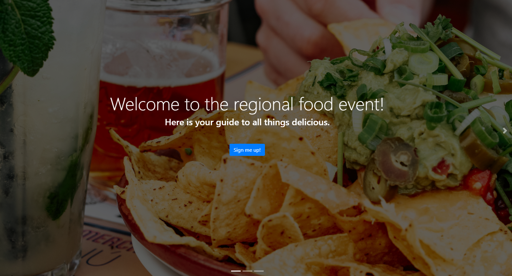

# Food Festival

  
    
  
   
  
   
  
   
  
   
  
  
  ## Description
  
  * As a user, I want the application to load quickly
  * As a user, I want to use the Food Festival application even if I don't have an internet connection
  * As a user, I want to download the app to the home screen on my mobile device
 
  ## Table of Contents
  - [Description](#description)
  - [Documentation](#documentation)
  - [Usage](#usage)
  - [Screenshot](#screenshot)
  - [Features](#features)
  - [Acknowledgements](#acknowledgements)
  - [License](#license)
  - [Testing](#testing)
  - [Contact](#contact)

  ## Documentation
  TBD
 
  ## Usage
  TBD

  ## Screenshot
   

  ## Features
  TBD
  
  # Acknowledgements
  Rob Atalla
    
  ## License
  
   
  Permission to use this application is granted under the MIT license. <https://opensource.org/licenses/MIT>

  ## Testing
  TBD

  ## Contact:
  Holler at me! <a href="mailto:rob.atalla@robatalla816.com">rob.atalla@robatalla816.com</a>